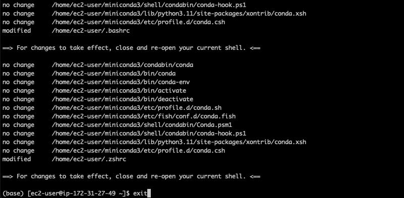
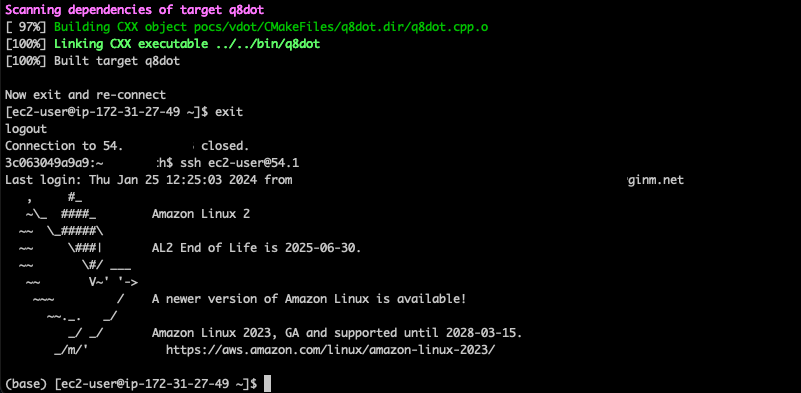

# Integrate Wickr with a standalone Large Language Model (LLM)

This sample will show you how to deploy a bot to your AWS Wickr network to query a Falcon 7b LLM that has been deployed to an Amazon EC2 instance in your AWS account. These steps can be modified to deploy to Wickr Enterprise, you will need to use the Wickr Enterprise Docker image, rather than the AWS Wickr cloud image.

## Prerequisites and limitations

## Prerequisites

- An existing AWS Wickr bot username and password
- An EC2 instance running AL2 of type t2.xlarge, with a minimum 15GiB root storage capacity (based on the Falcon 7b model used in this sample)

# Initial Configuration

1. SSH to your EC2 instance and then clone this repo (install Git with `sudo yum install git` if needed)
2. Copy **install.sh** to your ec2-user home directory
3. run `bash install.sh` **NOTE:** This will take ~10mins to install
4. When told "For changes to take effect, close and re-open your current shell", type **exit** and the script will auto-resume

5. When told "Now exit and re-connect", type **exit** and then re-connect

6. Enter the Falcon main folder `cd /home/ec2-user/ggllm/falcon-7b-instruct-GGML/`
7. Download the Falcon 7b model by running `wget https://huggingface.co/TheBloke/Falcon-7B-Instruct-GGML/resolve/main/falcon-7b-instruct.ggccv1.q4_0.bin?download=true -O falcon-7b-instruct.ggccv1.q4_0.bin`
8. Enter the following command to query the model, details on the various options can be found [here](https://huggingface.co/TheBloke/Falcon-7B-Instruct-GGML#compatibility) `../ggllm.cpp/build/bin/falcon_main -ngl 100 -t 4 -b 1 --mlock -m falcon-7b-instruct.ggccv1.q4_0.bin -enc -p "tell me three things to see in Berlin"`

## Configure the Wickr Integration

1. Run `cd /home/ec2-user/ggllm/ggllm.cpp/build/bin`
2. Copy the `falcon-7b-instruct.ggccv1.q4_0.bin` model to the `/home/ec2-user/ggllm/ggllm.cpp/build/bin` directory by running `cp /home/ec2-user/ggllm/falcon-7b-instruct-GGML/falcon-7b-instruct.ggccv1.q4_0.bin /home/ec2-user/ggllm/ggllm.cpp/build/bin` 
3. Copy the `llm-trigger.sh` file from this repository to the `/home/ec2-user/ggllm/ggllm.cpp/build/bin` directory
4. Make the `llm-trigger.sh` file executable by running `chmod +x llm-trigger.sh`
4. Test the Wickr integration script by entering `bash llm-trigger.sh "what three things should I do in Seattle?`. This will then trigger the `llm-trigger.sh` file to forward that query to the LLM. You will see the output within the `output.txt` file, as well as being displayed to stdout once the command completes

## Install Docker and the Wickr Integration

1. Install Docker CE with `sudo yum install docker -y`
2. Start Docker and configure to start on host reboot `sudo systemctl start docker; sudo systemctl enable docker`
3. Add the ec2-user to the Docker group `sudo usermod -aG docker ec2-user`
4. Exit and re-connect to your EC2. You should now be able to run `docker info` with no permissions errors
5. Enter the `software` directory in this repo, **once inside** run `tar czvf software.tar.gz *`
6. Create a new directory and copy that file to it `sudo mkdir /opt/WickIO; sudo cp software.tar.gz /opt/WickIO`
7. Run the WickrIO docker image `docker run -v /home/ec2-user/ggllm/ggllm.cpp/build/bin:/home/wickriouser/ggllm/ggllm.cpp/build/bin -v /opt/WickrIO:/opt/WickrIO --restart=always --name="llm_bot" -ti public.ecr.aws/x3s2s6k3/wickrio/bot-cloud:latest` or if using Wickr Enterprise, use the image listed [here](https://wickrinc.github.io/wickrio-docs/#installation)

## Configure the Wickr bot

1. Select `yes` if you wish see welcome message on startup
2. Enter `add` when prompted to enter a command
3. Enter the bot username and password when prompted (you will also need to identify the Wickr Enterprise config file location, if using Wickr Enterprise)
4. Select `yes` to auto-login
5. When asked to **Enter the bot configuration to use**, enter `import`
6. When asked for the location, enter `/opt/WickrIO`
7. Enter `llm-bot` for the integration name

The bot will now install.

**NOTE** You can ignore the warning that says `TypeError: Cannot convert undefined or null to object`
8. When you see **Successfully added record to the database!**, enter `start` and then provide the password when prompted
9. Type `list` to see the status of the bot, it should say **Running** after a few seconds
10. Send a sample question to the bot from your Wickr client. You can see the Falcon process starting by running `top`, and also the output being generated by running `watch cat /home/ec2-user/ggllm/ggllm.cpp/build/bin/output.txt`

## License

This library is licensed under the MIT-0 License. See the LICENSE file.